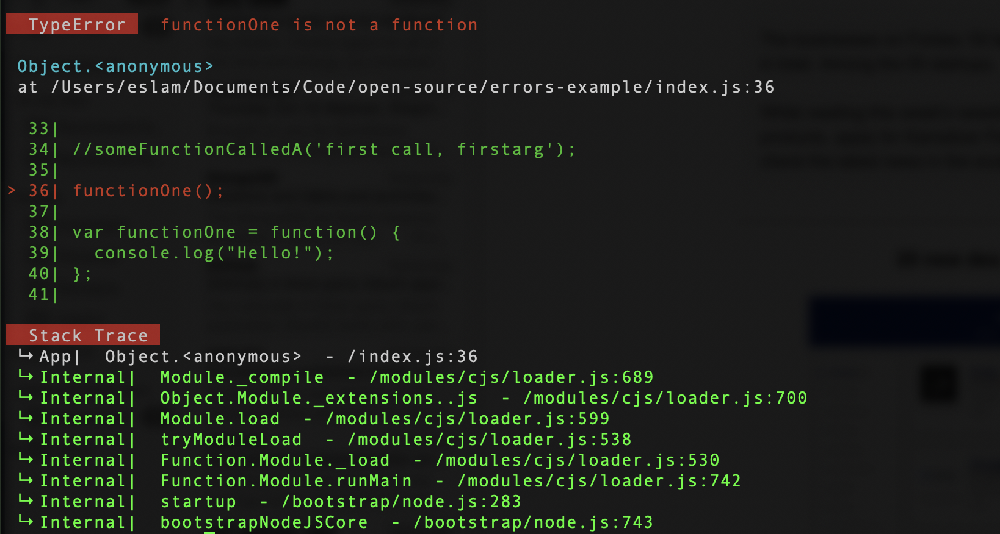

# better-errors
Better Nodejs error is a small nodejs package to render errors in a better way to make it easy for you to identify errors and fix it fast.




## Installation

Install with npm:

```
$ npm install better-errors
```

## Usage and Examples

1. Unhandled Exception 

Require `better-errors` on your code and it will catch the unhandled errors and render it.

```
require('better-errors')
```

2. Handled Exception

Import the `BetterError` function and use it to render errors

```js
const { BetterError } = require('better-errors');

//...

try{
    functionCall()
}catch(error){
    console.log(BetterError(error));
}
```

## Contributing

Contributions are what make the open source community such an amazing place to be learn, inspire, and create. Any contributions you make are **greatly appreciated**.

1. Fork the Project
2. Create your Feature Branch (`git checkout -b feature/AmazingFeature`)
3. Commit your Changes (`git commit -m 'Add some AmazingFeature'`)
4. Push to the Branch (`git push origin feature/AmazingFeature`)
5. Open a Pull Request


## License

Distributed under the MIT License. See `LICENSE` for more information.